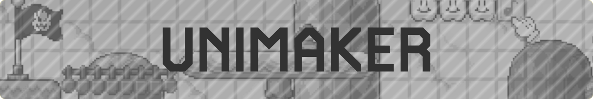

[][home]

# Overview

An easy-to-use level design tool. Featuring over twenty built-in themes and support for customized effects, graphics and songs that can be packed with your courses.

<p align="center"><a href="https://ninstars.itch.io/unimaker"></a></p>

- **Discover new courses and customizations in our [Discord][discord] ★**
- Learn how to make your own customizations: [Guide][guide]

# Compile

> This repository includes the source code for versions ``1.0.0``, ``1.1.0``, ``1.2.4`` (Latest stable release) and ``2.0.0``.

1. Clone the repository:
```bash
git clone https://github.com/ninstar/UniMaker.git
```
2. Download [GameMaker][gamemaker].
	- The version depends on the type of project you want to import:
		- Studio 1.4.9999 for .gmx projects.
		- Studio 2.2 or later for .ypp projects.
	> You can convert a .gmx project into a .yyp, but it would still require manual work to fix any potential incompatibility issue.
3. Extract the **.7z** file containing the version you want to use.
5. Open the project file (**.gmx** or **.yyp**).
6. Import the audio files (Optional step for stable releases)
	1. Download a compiled binary of the game.
	3. Go to **Included Files** and Import all **.ogg** files from ``\UniMaker``  (the directory where the binary is stored).
8. Go to **File ➜ Create Executable**.

# Credits

- **Creator** - NinStar
- **Code** - Gate, Hello Fangaming, NinStar, Ralphed
- **Art** - Jessé Vieira, Kopejo, NinStar, Neweegee, Nicke, Sednaiur, Shikaternia

[home]: https://ninstars.blogspot.com/p/unimaker.html
[gamemaker]: https://gamemaker.io/
[guide]: https://github.com/ninstar/UniMaker/wiki
[discord]: https://discord.gg/wZGW8DZ
